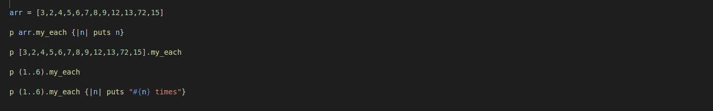
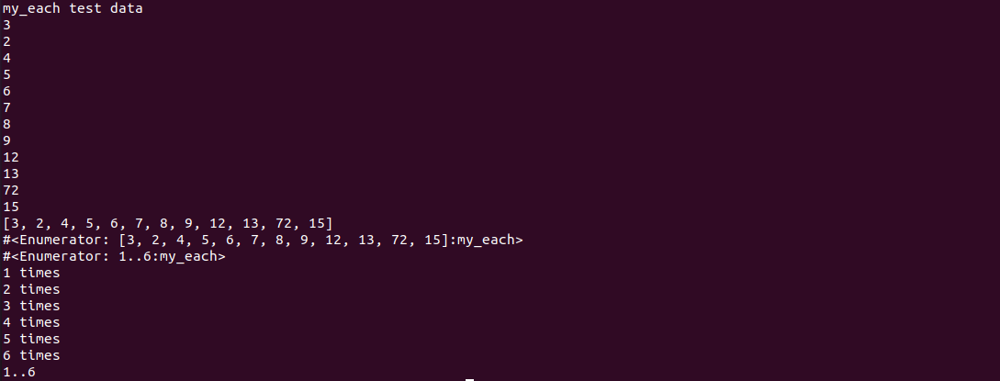
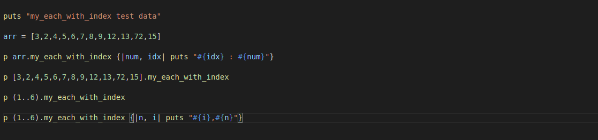
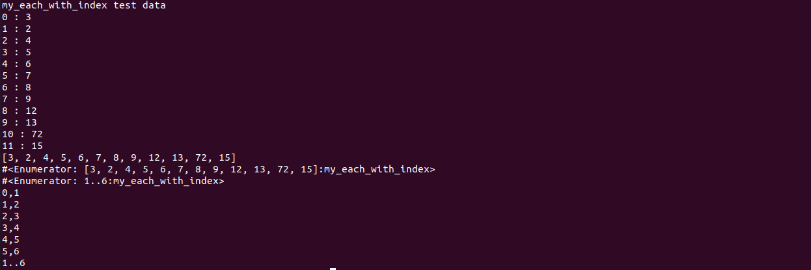
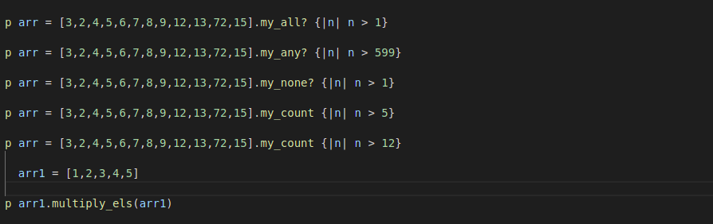
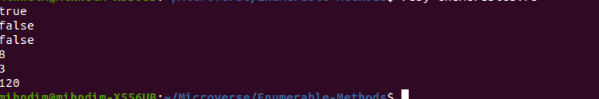
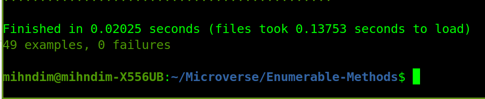

# Enumerable-Methods

>A set of enumerable methods in ruby re-created by the authors.

In the project we have replicated our own version of the following methods; 
- each, 
- each_with_index, 
- select, 
- all, 
- any, 
- none, 
- inject, 
- map using Ruby programming language. 

# Getting Started

- To run this program on your local machine, simply follow the steps below:

# Prerequisites
- Install the ruby programming language

# Usage

- Clone this repo on your local machine by running git clonehttps://github.com/German-Cobian/Enumerable-Methods.git
- cd into the folder you just cloned
- run ruby enumerables.rb

## Built With

- Ruby programming language

## Testing with Rspec
  This project is tested with Rspec which is a computer domain-specific language (DSL) testing tool written in the Ruby programming language

  

## How to get Rspec Running
- Run the following command in the terminal
    gem install rspec
- This command installs Rspec on your computer. You ensure that Rspec is installed by running the following command to see the installed version
    rspec --version
- You should get output similar to the following:
    RSpec 3.10
      rspec-core 3.10.1
      rspec-expectations 3.10.1
      rspec-mocks 3.10.2
      rspec-support 3.10.2
- The rspec gem comes packed with all we need to get started including the 5 gems listed above.
- Navigagte into the AdvancedBuildingBlocks-Enumerables folder
    cd AdvancedBuildingBlocks-Enumerables
- Run the following command to initialize Rspec
    rspec --init
- This generates a /spec folder and a .rspec file at the root of your project
- Finally, to run the tests, simple run:
    rspec

## Authors

👤 **Author1**

- GitHub: [@mihdim2020](https://github.com/mihndim2020)
- Twitter: [@mihndim](https://twitter.com/mihndim2020)
- LinkedIn: [Mih Julius](https://linkedin.com/mih-julius)

👤 **Author2**

- GitHub: [@German-Cobian](https://github.com/German-Cobian)
- Twitter: [@GermanCobian3](https://twitter.com/GermanCobian3)
- LinkedIn: [German Cobian](https://linkedin.com/german-cobian)

## 🤝 Contributing

Contributions, issues, and feature requests are welcome!

Feel free to check the [issues page](issues/).

## Show your support

Give a ⭐️ if you like this project!

## Acknowledgments

- Coding partner
- Standup team
- Mentor
- Microverse community

## 📝 License

MIT License

Copyright (c) 2021 Mihndim Julius and German Cobian

Permission is hereby granted, free of charge, to any person obtaining a copy
of this software and associated documentation files (the "Software"), to deal
in the Software without restriction, including without limitation the rights
to use, copy, modify, merge, publish, distribute, sublicense, and/or sell
copies of the Software, and to permit persons to whom the Software is
furnished to do so, subject to the following conditions:

The above copyright notice and this permission notice shall be included in all
copies or substantial portions of the Software.

THE SOFTWARE IS PROVIDED "AS IS", WITHOUT WARRANTY OF ANY KIND, EXPRESS OR
IMPLIED, INCLUDING BUT NOT LIMITED TO THE WARRANTIES OF MERCHANTABILITY,
FITNESS FOR A PARTICULAR PURPOSE AND NONINFRINGEMENT. IN NO EVENT SHALL THE
AUTHORS OR COPYRIGHT HOLDERS BE LIABLE FOR ANY CLAIM, DAMAGES OR OTHER
LIABILITY, WHETHER IN AN ACTION OF CONTRACT, TORT OR OTHERWISE, ARISING FROM,
OUT OF OR IN CONNECTION WITH THE SOFTWARE OR THE USE OR OTHER DEALINGS IN THE
SOFTWARE.
  Mih Julius Ndim

  GitHub: @mihdim2020
  Twitter: @mihndim
  LinkedIn: Mih Julius

👤 **Author**

 German Cobian
  
  GitHub: @German-Cobian

  twitter: https://twitter.com/GermanCobian3

## 🤝 Contributing

Contributions, issues, and feature requests are welcome!

## Show your support

Give a ⭐️ if you like this project!

## Acknowledgments

Microverse

## 📝 License

This project is [MIT](lic.url) licensed.
